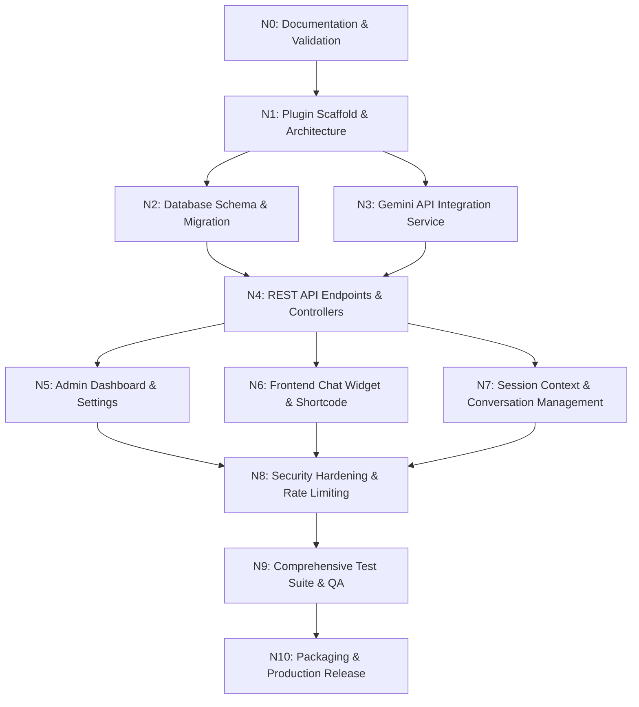

# Project Roadmap & Dependency Graph: Gemini Chat Assistant

## 1. Node Dependency Graph

## 2. Detailed Node Breakdown

| Node | Name | Focus & Deliverables | Status |
| :--- | :--- | :--- | :--- |
| **N0** | **Documentation Validation** | Establish & cross-validate all 20 specification and architecture documents. Zero application code. | **COMPLETED** |
| **N1** | **Plugin Scaffold & Setup** | Create plugin entrypoint (`gemini-chat-assistant.php`), PSR-4 autoloading, composer manifest, base classes. | **COMPLETED** |
| **N2** | **Database & Migrations** | Implement `Migrator`, `wp_gca_conversations`, `wp_gca_messages`, `wp_gca_logs` table creation routines. | **READY / NEXT** |
| **N3** | **Gemini Service Layer** | Build `GeminiClient`, token estimation, payload builders, and Google Gemini API communication. | Planned |
| **N4** | **REST API Controllers** | Register `gca/v1` routes: `/chat`, `/reset`, and `/health` with full validation callbacks. | Planned |
| **N5** | **Admin Dashboard Modules** | Build Settings UI, Logs & Analytics viewer, and Health self-test diagnostic module. | Planned |
| **N6** | **Frontend Chat Widget** | Build `[gemini_chat]` shortcode, floating UI widget, CSS styling, and message event listeners. | Planned |
| **N7** | **Session & Context Engine** | Implement multi-turn conversational history retrieval, session lifecycle, and rolling context window. | Planned |
| **N8** | **Security & Throttling** | Implement AES-256-GCM API key encryption, IP/transient rate limiter, and nonce hardening. | Planned |
| **N9** | **Testing Suite** | Implement PHPUnit unit tests, REST integration tests, static analysis, and security verification. | Planned |
| **N10** | **Packaging & Release** | Final production asset build, documentation finalization, and distribution packaging. | Planned |
