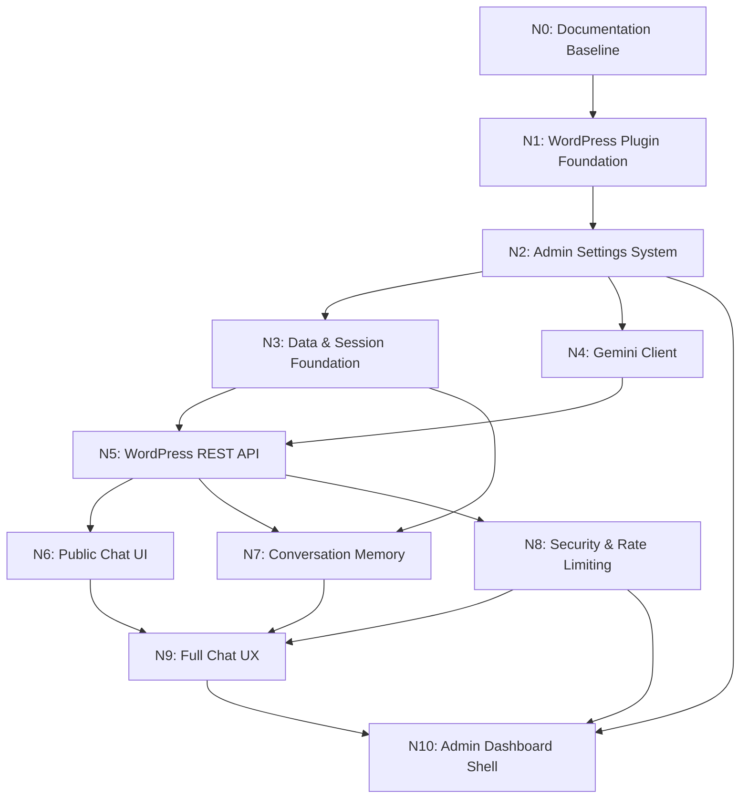

# Project Roadmap & Dependency Graph: Gemini Chat Assistant

## 1. Node Dependency Graph

## 2. Approved Node Breakdown

| Node | Name | Focus & Deliverables | Status |
| :--- | :--- | :--- | :--- |
| **N0** | **Documentation Baseline** | Establish & cross-validate all 20 specification and architecture documents. Zero application code. | **COMPLETED** |
| **N1** | **WordPress Plugin Foundation** | Plugin entrypoint (`gemini-chat-assistant.php`), lifecycle hooks (`class-activator.php`, `class-deactivator.php`, `class-plugin.php`), security index guards. | **COMPLETED** |
| **N2** | **Admin Settings System** | Settings storage, admin menu, configuration screens (API key status, model selection, system prompt, limits, privacy). | **COMPLETED** |
| **N3** | **Data & Session Foundation** | Custom database schema (`gca_conversations`, `gca_messages`), `Migrator`, repositories, and session service. | **COMPLETED** |
| **N4** | **Gemini Client** | Gemini API client service (`GeminiClient`), Interactions API (v1), payload construction, steps parser, and error normalizers. | **COMPLETED** |
| **N5** | **WordPress REST API** | REST route registration (`gca/v1`), `/chat`, `/reset`, `/health` controllers, and schema validators. | **COMPLETED** |
| **N6** | **Public Chat UI** | `[gemini_chat]` shortcode, frontend HTML/CSS chat widget, responsive styling. | Planned |
| **N7** | **Conversation Memory** | Session management, multi-turn history formatting, rolling context window. | Planned |
| **N8** | **Security & Rate Limiting** | AES-256-GCM API key encryption, transient-based IP/session rate limiter, nonce validation. | Planned |
| **N9** | **Full Chat UX** | Frontend JavaScript client, streaming/typing indicator, markdown rendering, error handling, reset flows. | Planned |
| **N10** | **Admin Dashboard Shell** | Complete admin dashboard tabs (Settings, Logs/Analytics, Health & Diagnostics self-test). | Planned |
