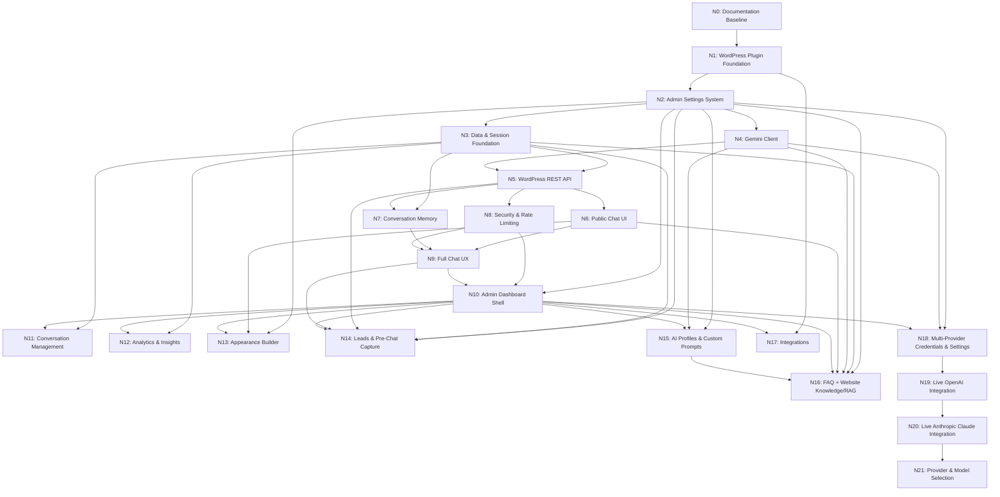

# Project Roadmap & Dependency Graph: Gemini Chat Assistant

## 1. Node Dependency Graph

## 2. Approved Node Breakdown

| Node | Name | Focus & Deliverables | Status |
| :--- | :--- | :--- | :--- |
| **N0** | **Documentation Baseline** | Establish & cross-validate all 20 specification and architecture documents. Zero application code. | **COMPLETED** |
| **N1** | **WordPress Plugin Foundation** | Plugin entrypoint (`gemini-chat-assistant.php`), lifecycle hooks (`class-activator.php`, `class-deactivator.php`, `class-plugin.php`), security index guards. | **COMPLETED** |
| **N2** | **Admin Settings System** | Settings storage, admin menu, configuration screens (API key status, model selection, system prompt, limits, privacy). | **COMPLETED** |
| **N3** | **Data & Session Foundation** | Custom database schema (`gca_conversations`, `gca_messages`), `Migrator`, repositories, and session service. | **COMPLETED** |
| **N4** | **Gemini Client** | Gemini API client service (`GeminiClient`), Interactions API (v1), payload construction, steps parser, and error normalizers. | **COMPLETED** |
| **N5** | **WordPress REST API** | REST route registration (`gca/v1`), `/chat`, `/reset`, `/health` controllers, and schema validators. | **COMPLETED** |
| **N6** | **Public Chat UI** | `[gemini_chat]` shortcode, frontend HTML/CSS chat widget, responsive styling. | **COMPLETED** |
| **N7** | **Conversation Memory** | Session management, multi-turn history formatting, rolling context window. | **COMPLETED** |
| **N8** | **Security & Rate Limiting** | Dual-tier transient rate limiter (5m/1h session & IP ceiling), HTTP 429 & Retry-After handling, secret leakage audits. | **COMPLETED** |
| **N9** | **Full Chat UX** | Production-quality frontend client (`chat.js`, `chat.css`), UX state model, unread badge, retry flow, autoscroll, rate limit countdown. | **COMPLETED** |
| **N10** | **Admin Dashboard Shell** | Top-level Gemini Chat menu, Dashboard overview, system status cards, setup checklist, quick actions, scoped admin styles. | **COMPLETED** |
| **N11** | **Conversation Management** | Secure WordPress Admin conversation module (Conversations submenu `gca-conversations`, server-side pagination, search/filtering, transcript thread view, close/reopen/delete actions with cascading message cleanup). | **COMPLETED** |
| **N12** | **Analytics & Insights** | Native WordPress Analytics module (Analytics submenu `gca-analytics`, date range filtering, real KPI aggregates, daily activity charts, status & audience & model breakdowns). | **COMPLETED** |
| **N13** | **Appearance Builder** | WordPress-native visual customizer (`gca-appearance`), live mock preview, avatar upload via Media Library, color palette, dimensions/radius clamping, launcher icons, device visibility, safe CSS variable injection, reset to defaults. | **COMPLETED** |
| **N14** | **Leads & Pre-Chat Capture** | Configurable pre-chat lead capture form (name, email, phone, requirement), server/client validation, Leads database table (`gca_leads`), LeadRepository, LeadService, REST `/prechat` endpoint, conversation association, Admin Leads management (`gca-leads`). | **COMPLETED** |
| **N15** | **AI Profiles & Custom Prompts** | WordPress-native AI Profile and Prompt Management system (AI Assistant submenu `gca-ai-assistant`, Options API storage `gca_ai_profiles`, active profile selection, role, instructions, tone, response style, rules, fallback message, duplicate, safe delete, migration from legacy system_instruction, centralized prompt builder in `ProfileService`, ChatService integration). | **COMPLETED** |
| **N16** | **FAQ + Website Knowledge/RAG** | WordPress-native FAQ system (Admin `gca-faqs`, public widget Home quick help items, zero-token static reading, `gca_faqs` table, `FaqRepository`), and Website Knowledge Grounding / RAG (`gca_knowledge_sources`, `gca_knowledge_chunks` tables, `KnowledgeRepository`, `KnowledgeIndexer` with multibyte sentence chunking and SHA-256 deduplication, `KnowledgeRetriever` lexical search and scoring, `KnowledgeContextBuilder` with prompt-injection defense, Admin `gca-knowledge` dashboard, and `ChatService` RAG integration). | **COMPLETED** |
| **N17** | **Integrations** | WordPress-native business integration framework (`IntegrationInterface`, `ActionInterface`, `ActionResult`, `ActionValidator`, `ActionExecutor`, `IntegrationRegistry`, Admin `gca-integrations`). Subnode N17.1 (Framework Foundation) = COMPLETED. Subnode N17.2 (WooCommerce Read Integration: `SearchProductsAction`, `GetProductAction`, `SearchByCategoryAction`) = COMPLETED. Subnode N17.3 (Human Handoff: `HandoffService`, `HandoffRepository`, `CreateHandoffAction`, `HandoffIntegration`, Admin `gca-handoffs`, schema v1.3.0) = COMPLETED. Subnode N17.4 (Email Notifications: `NotificationService`, `SendHandoffNotificationAction`, native `wp_mail()`, admin settings, idempotency) = COMPLETED. Subnode N17.5 (Direct Contact Channels: phone `tel:`, email `mailto:`, WhatsApp `https://wa.me/`, admin settings, public widget deep links, zero external APIs) = COMPLETED. | **COMPLETED** |
| **N18** | **Secure Multi-Provider Credentials & Admin Settings** | Secure WordPress admin configuration for AI providers (Google Gemini, OpenAI, Anthropic Claude). `ProviderInterface`, `ProviderRegistry`, `GeminiProvider`, `OpenAIProvider`, `ClaudeProvider`, server-side credential management (`gca_provider_credentials` with OpenSSL AES-256-CBC encryption or env/constant overrides), default provider selection, per-provider toggles/models, explicit key removal, zero live OpenAI/Claude HTTP calls in N18, zero client-side credential exposure. | **COMPLETED** |
| **N19** | **Live OpenAI Integration** | Direct live OpenAI Responses API integration (`OpenAIClient`, `POST https://api.openai.com/v1/responses`, server-side Bearer auth, `store: false`, multi-turn history normalization, `instructions` prompt + RAG grounding, `ProviderResponse` token usage normalization, HTTP 400/401/404/408/429/500/WP_Error mapping to `ProviderException`, secret scrubbing, admin 1-token Test Connection, dynamic routing in `ChatService`, zero Gemini regressions, Claude preserved as placeholder). | **COMPLETED** |
| **N20** | **Live Anthropic Claude Integration** | Direct live Anthropic Claude Messages API integration (`ClaudeClient`, `POST https://api.anthropic.com/v1/messages`, `x-api-key` + `anthropic-version: 2023-06-01` headers, `system` top-level prompt mapping + RAG grounding, multi-turn history normalization, `max_tokens` handling, multiple content block parsing, token usage extraction, stop reason mapping, HTTP 400/401/403/404/413/429/500/529/WP_Error mapping to `ProviderException`, secret scrubbing, admin 1-token Test Connection, unified multi-turn routing in `ChatService`, zero Gemini/OpenAI regressions). | **COMPLETED** |
| **N21** | **Provider & Model Selection** | Centralized AI provider and model selection architecture (`ModelRegistry`, `ProviderSelectionService`). Admin default provider and per-provider model selectors; public selection toggles (`allow_public_provider_selection`, `allow_public_model_selection`); safe public REST `/providers` metadata endpoint; accessible frontend toolbar (`.gca-ai-selector-bar`) with dynamic client-side model updates; strict server-side validation; seamless mid-conversation switching with history & analytics preservation. | **COMPLETED** |
| **N22** | **Multi-AI End-to-End Validation & Production Readiness** | End-to-end audit, multi-provider pipeline validation, security and credential hardening, rate limiting, error matrix normalization, production release readiness. | **COMPLETED** |
| **N23** | **Production Release & Deployment Packaging** | Production distribution build, packaging, deployment documentation, and final release. | **PLANNED** |
